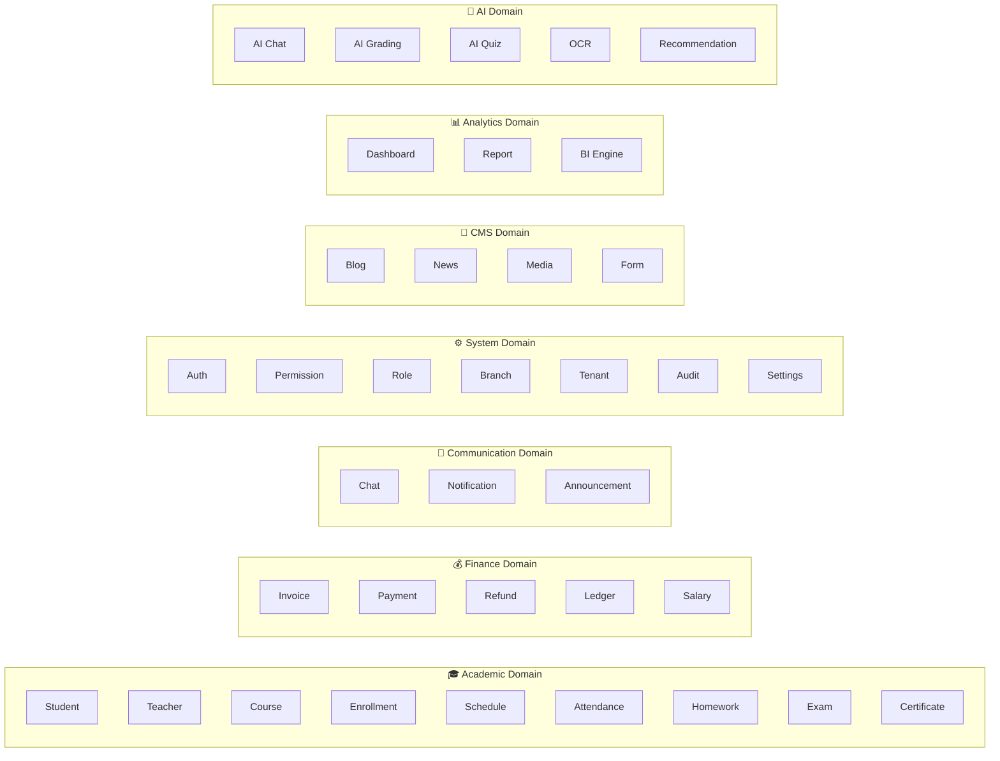

# 📘 Software Architecture Specification (SAS)
## DASHBOARDTHANGTINHOC — Education Management ERP/LMS
### Version 1.0 | Principal Architect Review

---

# Table of Contents

1. [Architecture Vision](#section-1)
2. [Architecture Style](#section-2)
3. [Business Domains](#section-3)
4. [Modules](#section-4)
5. [Dependency Rules](#section-5)
6. [Backend Folder Structure](#section-6)
7. [Frontend Folder Structure](#section-7)
8. [Coding Standards](#section-8)
9. [Role & Permission Design](#section-9)
10. [Database Design](#section-10)
11. [API Standards](#section-11)
12. [Security Standards](#section-12)
13. [Performance Standards](#section-13)
14. [Testing Strategy](#section-14)
15. [Future Scalability](#section-15)
16. [Architecture Decision Records](#section-16)
17. [Development Rules](#section-17)
18. [Migration Roadmap](#section-18)

---

<a id="section-1"></a>
# Section 1 — Architecture Vision

## 1.1 Business Goals

| Goal | Description |
|---|---|
| **Operational Efficiency** | Automate enrollment, scheduling, attendance, grading, and finance workflows to reduce manual overhead by 80% |
| **Multi-Branch Scalability** | Support 100+ branches operating independently with centralized oversight |
| **Multi-Tenant Readiness** | Enable white-label deployment for multiple education organizations on shared infrastructure |
| **Revenue Growth** | Enable online learning (LMS), AI-assisted grading, and self-service student portals to expand service offerings |
| **Data-Driven Decisions** | Provide real-time dashboards, financial reports, and learning analytics for management |

## 1.2 Technical Goals

| Goal | Description |
|---|---|
| **Modularity** | Each business capability is an independent module with clear boundaries |
| **Maintainability** | Any developer can modify one module without understanding the entire system. Target: max 300 lines per file |
| **Testability** | Every module is independently testable. Target: 80% unit test coverage on services |
| **Extensibility** | New features (AI modules, new report types) can be added without modifying existing code |
| **Developer Onboarding** | New developers productive within 1 week using standardized patterns |

## 1.3 Scalability Goals

| Metric | Target |
|---|---|
| Concurrent Users | 50,000 simultaneous |
| Total Students | 500,000 |
| Total Teachers | 20,000 |
| Total Staff | 2,000 |
| Branches | 500 |
| Chat Messages | 100M+ documents |
| Notifications | 50M+ documents |
| API Response Time (p95) | < 200ms |
| WebSocket Connections | 20,000 concurrent |

## 1.4 Maintainability Goals

- **Module Isolation**: Changing finance logic MUST NOT affect student module
- **Single Responsibility**: Every file has exactly ONE reason to change
- **Dependency Direction**: Dependencies point inward (Infrastructure → Application → Domain)
- **No God Objects**: No file exceeds 300 lines without architectural justification
- **Convention Over Configuration**: Standardized patterns reduce decision fatigue

## 1.5 Security Goals

- Zero-trust architecture: Every request authenticated + authorized
- Permission-based access control (never role-based string checks)
- Tenant data isolation at query level
- Audit trail for all write operations
- CSRF + rate limiting on all mutating endpoints
- MFA support for admin roles
- Token rotation with blacklist for compromised sessions

## 1.6 Performance Goals

- MongoDB queries: < 50ms (p95) with proper indexes and projections
- Redis cache hit ratio: > 85% for frequently accessed data
- WebSocket message delivery: < 100ms end-to-end
- Frontend initial load: < 3 seconds on 4G connection
- API cold start: < 2 seconds after deployment

---

<a id="section-2"></a>
# Section 2 — Architecture Style

## 2.1 Chosen Architecture: **Modular Monolith + Clean Architecture**

```text
┌─────────────────────────────────────────────────────────────┐
│                    Presentation Layer                         │
│            (HTTP Controllers, WebSocket Handlers)            │
├─────────────────────────────────────────────────────────────┤
│                    Application Layer                         │
│          (Services, Use Cases, DTOs, Validators)             │
├─────────────────────────────────────────────────────────────┤
│                      Domain Layer                            │
│     (Business Rules, Domain Events, Value Objects)           │
├─────────────────────────────────────────────────────────────┤
│                   Infrastructure Layer                       │
│    (Repositories, External APIs, Queue, Email, Storage)      │
└─────────────────────────────────────────────────────────────┘
```

## 2.2 Why Modular Monolith?

| Consideration | Microservices | Modular Monolith ✅ | Monolith |
|---|---|---|---|
| Team size (1-5 devs) | ❌ Overkill | ✅ Perfect | ✅ OK |
| Deployment complexity | ❌ High | ✅ Low | ✅ Low |
| Module boundaries | ✅ Enforced | ✅ By convention | ❌ None |
| Data consistency | ❌ Eventual | ✅ Strong | ✅ Strong |
| Refactoring difficulty | ❌ Cross-service | ✅ In-process | ❌ Spaghetti risk |
| Future microservice extract | ✅ Native | ✅ Easy migration | ❌ Impossible |
| Infrastructure cost | ❌ High | ✅ Low | ✅ Low |

**Decision**: Modular Monolith gives us the **isolation benefits** of microservices with the **simplicity** of a monolith. Each module can be extracted into a microservice later if needed.

## 2.3 Why Clean Architecture Layers?

- **Dependency Rule**: Source code dependencies point INWARD only
- **Framework Independence**: Express, Mongoose, Redis are implementation details, not architecture
- **Testability**: Business logic has ZERO dependency on HTTP or database
- **Replaceability**: Swap MongoDB for PostgreSQL without touching business rules

## 2.4 Layer Responsibilities

| Layer | Knows About | Does NOT Know About |
|---|---|---|
| **Controller** | Service, DTO, Validator | Repository, Database, Models |
| **Service** | Repository interfaces, Domain rules, Events | HTTP, Express, req/res |
| **Repository** | Mongoose Model, Query builder | Business rules, HTTP |
| **Model** | Schema definition only | Business rules, Services |

---

<a id="section-3"></a>
# Section 3 — Business Domains

## 3.1 Domain Map



## 3.2 Domain Responsibilities

### 🎓 Academic Domain
**Owner**: Core education operations
- Student lifecycle: registration → enrollment → learning → graduation
- Teacher management: assignment, schedule, performance
- Course catalog: definition, pricing, prerequisites
- Learning execution: scheduling, attendance, homework, exams
- Achievement: certificates, transcripts

### 💰 Finance Domain
**Owner**: All monetary transactions
- Invoice generation for enrollment fees
- Payment processing and reconciliation (SePay QR integration)
- Refund workflow with approval chain
- Double-entry ledger for audit compliance
- Teacher salary calculation based on sessions taught

### 💬 Communication Domain
**Owner**: All human-to-human and system-to-human messaging
- Real-time chat (1:1 and group) via WebSocket
- Push notifications (in-app, email, future: SMS)
- Announcements (broadcast to roles/branches)

### ⚙️ System Domain
**Owner**: Cross-cutting infrastructure
- Authentication (JWT, MFA, OAuth)
- Authorization (RBAC with permission-based checks)
- Multi-branch data isolation
- Multi-tenant configuration
- Audit logging for compliance
- System settings and feature flags

### 📝 CMS Domain
**Owner**: Content management
- Blog posts and news articles
- Media/file management (images, documents, videos)
- Public registration forms
- Landing page content

### 📊 Analytics Domain
**Owner**: Business intelligence
- Real-time dashboards per role
- Revenue reports, student progress reports
- BI data aggregation pipelines

### 🤖 AI Domain (Future)
**Owner**: Machine learning features
- AI-powered chatbot for student support
- Automated grading for subjective answers
- AI quiz generation from course materials
- OCR for document processing
- Learning path recommendations

---

<a id="section-4"></a>
# Section 4 — Modules

## 4.1 Academic Domain Modules

### Module: `student`
| Aspect | Detail |
|---|---|
| **Purpose** | Manage student lifecycle from registration to graduation |
| **Responsibilities** | CRUD student profiles, enrollment management, learning progress tracking, exam progress, branch assignment |
| **Dependencies** | `auth`, `course`, `branch`, `finance` (via events) |
| **Public APIs** | `GET /students`, `POST /students`, `PUT /students/:id`, `DELETE /students/:id`, `GET /students/:id/full-detail` |

### Module: `teacher`
| Aspect | Detail |
|---|---|
| **Purpose** | Manage teacher profiles, assignments, and performance |
| **Responsibilities** | CRUD teacher profiles, student assignment, schedule management, salary tracking |
| **Dependencies** | `auth`, `course`, `branch`, `schedule` |
| **Public APIs** | `GET /teachers`, `POST /teachers`, `PUT /teachers/:id`, `DELETE /teachers/:id` |

### Module: `course`
| Aspect | Detail |
|---|---|
| **Purpose** | Define course catalog with pricing and curriculum |
| **Responsibilities** | CRUD courses, pricing tiers, exam subject mapping, prerequisite chains |
| **Dependencies** | `branch` (for branch-specific pricing) |
| **Public APIs** | `GET /courses`, `POST /courses`, `PUT /courses/:id`, `DELETE /courses/:id` |

### Module: `enrollment`
| Aspect | Detail |
|---|---|
| **Purpose** | Manage student-course binding with payment status |
| **Responsibilities** | Enroll student in course, cancel enrollment with refund, track payment status, session counting |
| **Dependencies** | `student`, `course`, `finance` |
| **Public APIs** | `POST /students/:id/enrollments`, `DELETE /students/:id/enrollments/:eid`, `PUT /students/:id/enrollments/:eid/pay` |

### Module: `schedule`
| Aspect | Detail |
|---|---|
| **Purpose** | Time-based assignment of teachers to students |
| **Responsibilities** | Create/manage teaching schedules, conflict detection, recurring schedule patterns |
| **Dependencies** | `student`, `teacher`, `course`, `branch` |
| **Public APIs** | `GET /schedules`, `POST /schedules`, `PUT /schedules/:id`, `DELETE /schedules/:id` |

### Module: `attendance`
| Aspect | Detail |
|---|---|
| **Purpose** | Track student presence and session consumption |
| **Responsibilities** | Check-in/check-out, session decrement, attendance history, QR-based attendance |
| **Dependencies** | `student`, `schedule`, `teacher` |
| **Public APIs** | `POST /attendance/check-in`, `GET /attendance/history` |

### Module: `exam`
| Aspect | Detail |
|---|---|
| **Purpose** | Manage examination lifecycle |
| **Responsibilities** | Question bank management, exam session creation, anti-cheat monitoring, auto-grading, score recording |
| **Dependencies** | `student`, `course`, `teacher` |
| **Public APIs** | `GET /exams`, `POST /exams`, `POST /exams/:id/submit`, `GET /exams/:id/results` |

### Module: `certificate`
| Aspect | Detail |
|---|---|
| **Purpose** | Issue completion certificates |
| **Responsibilities** | Certificate template management, PDF generation, verification QR codes |
| **Dependencies** | `student`, `course` |
| **Public APIs** | `POST /certificates/generate`, `GET /certificates/:id/verify` |

---

## 4.2 Finance Domain Modules

### Module: `payment`
| Aspect | Detail |
|---|---|
| **Purpose** | Process incoming payments |
| **Responsibilities** | SePay webhook handling, QR code generation, payment matching to enrollment, receipt generation |
| **Dependencies** | `student`, `enrollment`, `ledger`, `branch` |
| **Public APIs** | `POST /payments/webhook`, `POST /payments/manual`, `GET /payments/history` |

### Module: `refund`
| Aspect | Detail |
|---|---|
| **Purpose** | Handle refund workflow |
| **Responsibilities** | Refund request creation, approval chain, amount calculation, ledger reversal |
| **Dependencies** | `enrollment`, `ledger`, `student` |
| **Public APIs** | `POST /refunds`, `PUT /refunds/:id/approve`, `PUT /refunds/:id/reject` |

### Module: `ledger`
| Aspect | Detail |
|---|---|
| **Purpose** | Financial audit trail (double-entry bookkeeping) |
| **Responsibilities** | Credit/debit entries, balance calculation, reconciliation, financial reports, idempotent write operations |
| **Dependencies** | `branch` (for branch-level reporting) |
| **Public APIs** | `GET /ledger/entries`, `GET /ledger/balance`, `GET /ledger/report` |

---

## 4.3 Communication Domain Modules

### Module: `chat`
| Aspect | Detail |
|---|---|
| **Purpose** | Real-time messaging |
| **Responsibilities** | 1:1 and group messaging, file sharing, message reactions, read receipts, message recall |
| **Dependencies** | `auth`, `notification` |
| **Public APIs** | `GET /messages/conversations`, `POST /messages/send`, WebSocket events |

### Module: `notification`
| Aspect | Detail |
|---|---|
| **Purpose** | System-to-user notifications |
| **Responsibilities** | Notification creation, delivery tracking, read status, batch delivery via queue |
| **Dependencies** | `auth` (for user targeting) |
| **Public APIs** | `GET /notifications`, `PUT /notifications/:id/read`, `PUT /notifications/read-all` |

---

## 4.4 System Domain Modules

### Module: `auth`
| Aspect | Detail |
|---|---|
| **Purpose** | Identity verification |
| **Responsibilities** | Login, logout, JWT issuance, refresh token rotation, MFA (TOTP), password reset, OAuth (Google) |
| **Dependencies** | None (leaf module) |
| **Public APIs** | `POST /auth/login`, `POST /auth/logout`, `POST /auth/refresh`, `POST /auth/mfa/*` |

### Module: `permission`
| Aspect | Detail |
|---|---|
| **Purpose** | Access control |
| **Responsibilities** | Permission definitions, role-to-permission mapping, runtime permission checking |
| **Dependencies** | `auth` |
| **Public APIs** | `GET /permissions`, `PUT /roles/:id/permissions` |

### Module: `branch`
| Aspect | Detail |
|---|---|
| **Purpose** | Organizational unit management |
| **Responsibilities** | Branch CRUD, data isolation queries, branch-specific settings |
| **Dependencies** | `tenant` |
| **Public APIs** | `GET /branches`, `POST /branches`, `PUT /branches/:id`, `DELETE /branches/:id` |

### Module: `audit`
| Aspect | Detail |
|---|---|
| **Purpose** | Compliance logging |
| **Responsibilities** | Record all write operations, who/what/when/where, tamper-proof storage |
| **Dependencies** | None (receives events from all modules) |
| **Public APIs** | `GET /audit/logs` (admin only) |

### Module: `settings`
| Aspect | Detail |
|---|---|
| **Purpose** | System configuration |
| **Responsibilities** | Feature flags, system-wide settings, tenant-specific overrides |
| **Dependencies** | `branch`, `tenant` |
| **Public APIs** | `GET /settings`, `PUT /settings/:key` |

---

<a id="section-5"></a>
# Section 5 — Dependency Rules

## 5.1 Core Principle

> A module MAY only depend on modules listed in its dependency declaration.
> A module MUST NEVER import from a module not in its dependency list.
> Communication between non-dependent modules MUST use Domain Events.

## 5.2 Dependency Matrix

| Module ↓ calls → | auth | student | teacher | course | enrollment | schedule | branch | finance | chat | notification | exam | audit |
|---|---|---|---|---|---|---|---|---|---|---|---|---|
| **auth** | — | ❌ | ❌ | ❌ | ❌ | ❌ | ❌ | ❌ | ❌ | ❌ | ❌ | ❌ |
| **student** | ✅ | — | ❌ | ✅ | ✅ | ❌ | ✅ | 🔶 | ❌ | ❌ | ❌ | ❌ |
| **teacher** | ✅ | ❌ | — | ✅ | ❌ | ✅ | ✅ | ❌ | ❌ | ❌ | ❌ | ❌ |
| **course** | ❌ | ❌ | ❌ | — | ❌ | ❌ | ✅ | ❌ | ❌ | ❌ | ❌ | ❌ |
| **enrollment** | ❌ | ✅ | ❌ | ✅ | — | ❌ | ❌ | 🔶 | ❌ | ❌ | ❌ | ❌ |
| **schedule** | ❌ | ✅ | ✅ | ✅ | ❌ | — | ✅ | ❌ | ❌ | ❌ | ❌ | ❌ |
| **attendance** | ❌ | ✅ | ✅ | ❌ | ❌ | ✅ | ❌ | ❌ | ❌ | ❌ | ❌ | ❌ |
| **exam** | ❌ | ✅ | ✅ | ✅ | ❌ | ❌ | ❌ | ❌ | ❌ | ❌ | — | ❌ |
| **payment** | ❌ | ✅ | ❌ | ❌ | ✅ | ❌ | ✅ | ✅ | ❌ | 🔶 | ❌ | ❌ |
| **refund** | ❌ | ✅ | ❌ | ❌ | ✅ | ❌ | ❌ | ✅ | ❌ | 🔶 | ❌ | ❌ |
| **chat** | ✅ | ❌ | ❌ | ❌ | ❌ | ❌ | ❌ | ❌ | — | ✅ | ❌ | ❌ |
| **notification** | ✅ | ❌ | ❌ | ❌ | ❌ | ❌ | ❌ | ❌ | ❌ | — | ❌ | ❌ |
| **audit** | ❌ | ❌ | ❌ | ❌ | ❌ | ❌ | ❌ | ❌ | ❌ | ❌ | ❌ | — |

**Legend**: ✅ Direct call allowed | 🔶 Via Domain Events only | ❌ Forbidden

## 5.3 Event-Based Communication

Modules that MUST NOT call each other directly use Domain Events:

```text
enrollment.cancelled → Event: ENROLLMENT_CANCELLED
  → finance listens → creates refund ledger entry
  → notification listens → sends refund confirmation

payment.received → Event: PAYMENT_RECEIVED
  → enrollment listens → marks enrollment as paid
  → notification listens → sends payment receipt

student.created → Event: STUDENT_CREATED
  → notification listens → sends welcome message
  → audit listens → logs creation
```

---

<a id="section-6"></a>
# Section 6 — Backend Folder Structure

```text
src/
│
├── bootstrap/                          # Application startup
│   ├── app.js                          # Express factory (middleware, error handling)
│   ├── database.js                     # MongoDB connection
│   ├── redis.js                        # Redis connection
│   ├── socket.js                       # Socket.io setup + event routing
│   ├── cron.js                         # Scheduled jobs registry
│   └── routes.js                       # Central route mounting
│
├── shared/                             # Cross-cutting concerns
│   ├── middleware/
│   │   ├── authenticate.js             # JWT verification → req.currentUser
│   │   ├── authorize.js                # Permission-based access: authorize('student:create')
│   │   ├── validate.js                 # Request body/query validation wrapper
│   │   ├── rateLimiter.js              # Redis-backed rate limiting
│   │   ├── tenantResolver.js           # Resolve tenant from header/subdomain
│   │   ├── branchFilter.js             # Inject branch scope into queries
│   │   └── errorHandler.js             # Global error → JSON response
│   │
│   ├── errors/
│   │   ├── AppError.js                 # Base error (statusCode, isOperational)
│   │   ├── ValidationError.js          # 400 — input validation failures
│   │   ├── NotFoundError.js            # 404 — resource not found
│   │   ├── UnauthorizedError.js        # 401 — authentication failure
│   │   ├── ForbiddenError.js           # 403 — permission denied
│   │   └── ConflictError.js            # 409 — duplicate / conflict
│   │
│   ├── repository/
│   │   └── BaseRepository.js           # CRUD base: find, findById, create, update, delete
│   │
│   ├── utils/
│   │   ├── responseBuilder.js          # { success, data, message, meta }
│   │   ├── pagination.js               # Cursor-based & offset pagination helpers
│   │   ├── cache.js                    # Redis cache get/set/invalidate
│   │   └── eventBus.js                 # In-process domain event emitter
│   │
│   ├── constants/
│   │   ├── permissions.js              # All permission definitions
│   │   ├── roles.js                    # Role → permission mapping
│   │   ├── httpStatus.js               # HTTP status code constants
│   │   └── events.js                   # Domain event name constants
│   │
│   └── types/
│       └── index.js                    # JSDoc @typedef for shared types
│
├── modules/                            # Business modules (DDD bounded contexts)
│   │
│   ├── auth/
│   │   ├── auth.routes.js              # Route definitions only
│   │   ├── auth.controller.js          # HTTP request/response handling
│   │   ├── auth.service.js             # Business logic (login, token rotation)
│   │   ├── auth.repository.js          # Database queries
│   │   ├── auth.validator.js           # Joi/Zod schemas for input
│   │   ├── auth.dto.js                 # Data transfer objects
│   │   ├── auth.permissions.js         # Module-specific permission constants
│   │   ├── auth.events.js              # Domain events this module emits
│   │   ├── auth.constants.js           # Module-specific constants
│   │   └── __tests__/
│   │       ├── auth.service.test.js
│   │       └── auth.controller.test.js
│   │
│   ├── student/
│   │   ├── student.routes.js
│   │   ├── student.controller.js
│   │   ├── student.service.js
│   │   ├── student.repository.js
│   │   ├── student.validator.js
│   │   ├── student.dto.js
│   │   ├── student.permissions.js
│   │   ├── student.events.js
│   │   └── __tests__/
│   │
│   ├── teacher/                        # Same pattern
│   ├── course/                         # Same pattern
│   ├── enrollment/                     # Same pattern
│   ├── schedule/                       # Same pattern
│   ├── attendance/                     # Same pattern
│   ├── exam/                           # Same pattern
│   ├── certificate/                    # Same pattern
│   ├── payment/                        # Same pattern
│   ├── refund/                         # Same pattern
│   ├── ledger/                         # Same pattern
│   ├── chat/                           # Same pattern
│   ├── notification/                   # Same pattern
│   ├── branch/                         # Same pattern
│   ├── settings/                       # Same pattern
│   ├── audit/                          # Same pattern
│   ├── report/                         # Same pattern
│   ├── dashboard/                      # Same pattern
│   ├── blog/                           # Same pattern
│   ├── media/                          # Same pattern
│   └── support/                        # Same pattern
│
├── models/                             # Mongoose schemas (shared, read-only reference)
│   ├── Student.js
│   ├── Teacher.js
│   ├── Course.js
│   ├── Branch.js
│   ├── LedgerEntry.js
│   ├── Message.js
│   ├── Notification.js
│   └── ...
│
├── infrastructure/                     # External service integrations
│   ├── email/
│   │   └── emailService.js            # Nodemailer wrapper
│   ├── storage/
│   │   └── fileStorage.js             # Local/S3 file upload
│   ├── queue/
│   │   ├── queueManager.js            # BullMQ setup
│   │   └── workers/
│   │       ├── emailWorker.js
│   │       └── notificationWorker.js
│   ├── ai/
│   │   └── aiService.js               # Google GenAI wrapper
│   ├── pdf/
│   │   └── pdfGenerator.js            # Invoice/certificate PDF
│   └── payment/
│       └── sepayWebhook.js            # SePay payment gateway
│
├── config/
│   ├── index.js                       # Central config from env vars
│   └── validateEnv.js                 # Startup env validation
│
├── server.js                          # HTTP + Socket server bootstrap ONLY
└── worker.js                          # BullMQ worker process
```

### Folder Explanation

| Folder | Purpose | Rules |
|---|---|---|
| `bootstrap/` | Application wiring — connects all pieces | No business logic |
| `shared/` | Code used by 3+ modules | Must be stateless |
| `modules/` | Business capabilities — heart of the system | Each module is self-contained |
| `models/` | Mongoose schema definitions only | No business logic, no query helpers |
| `infrastructure/` | External service wrappers | Adapter pattern — easily swappable |
| `config/` | Environment-based configuration | Read-only at runtime |

---

<a id="section-7"></a>
# Section 7 — Frontend Folder Structure

```text
client/src/
│
├── app/
│   ├── App.jsx                         # Root component
│   ├── router.jsx                      # All route definitions
│   ├── providers.jsx                   # Context provider composition
│   └── guards/
│       ├── AuthGuard.jsx               # Authentication check
│       └── PermissionGuard.jsx         # Permission-based route guard
│
├── shared/
│   ├── components/                     # Reusable UI atoms/molecules
│   │   ├── Button/
│   │   ├── Modal/
│   │   ├── Table/
│   │   ├── Form/
│   │   ├── Card/
│   │   ├── Tabs/
│   │   ├── Pagination/
│   │   ├── FileUpload/
│   │   ├── Avatar/
│   │   └── LoadingSpinner/
│   │
│   ├── hooks/                          # Reusable custom hooks
│   │   ├── useAuth.js
│   │   ├── usePagination.js
│   │   ├── useDebounce.js
│   │   ├── useInactivityTimer.js
│   │   └── useMediaQuery.js
│   │
│   ├── utils/                          # Pure helper functions
│   │   ├── formatCurrency.js
│   │   ├── formatDate.js
│   │   ├── validators.js
│   │   └── storage.js
│   │
│   ├── constants/
│   │   ├── permissions.js
│   │   ├── roles.js
│   │   └── routes.js
│   │
│   └── layouts/
│       ├── DashboardLayout.jsx
│       ├── AuthLayout.jsx
│       └── PublicLayout.jsx
│
├── features/                           # Feature-Based Architecture
│   │
│   ├── auth/
│   │   ├── components/
│   │   │   ├── LoginForm.jsx
│   │   │   ├── MfaVerify.jsx
│   │   │   └── PasswordReset.jsx
│   │   ├── hooks/
│   │   │   └── useLogin.js
│   │   ├── services/
│   │   │   └── authApi.js              # API calls for auth only
│   │   └── pages/
│   │       ├── LoginPage.jsx
│   │       └── AdminLoginPage.jsx
│   │
│   ├── student/
│   │   ├── components/
│   │   │   ├── StudentTable.jsx        # Pure table rendering
│   │   │   ├── StudentFilters.jsx      # Filter controls
│   │   │   ├── StudentDetailModal/     # Split into tabs
│   │   │   │   ├── index.jsx           # Orchestrator (max 100 lines)
│   │   │   │   ├── ProfileTab.jsx
│   │   │   │   ├── EnrollmentTab.jsx
│   │   │   │   ├── FinanceTab.jsx
│   │   │   │   ├── AttendanceTab.jsx
│   │   │   │   └── ExamProgressTab.jsx
│   │   │   └── StudentImportModal.jsx
│   │   ├── hooks/
│   │   │   ├── useStudents.js          # List + pagination
│   │   │   └── useStudentDetail.js     # Single student data
│   │   ├── services/
│   │   │   └── studentApi.js
│   │   └── pages/
│   │       └── StudentManagementPage.jsx
│   │
│   ├── teacher/                        # Same pattern
│   ├── course/
│   ├── finance/
│   ├── chat/
│   ├── exam/
│   ├── schedule/
│   ├── notification/
│   ├── dashboard/
│   ├── settings/
│   ├── report/
│   └── support/
│
├── services/                           # Shared API infrastructure
│   ├── apiClient.js                    # Base fetch config + interceptors (MAX 150 lines)
│   ├── tokenManager.js                 # Token storage + refresh logic
│   └── csrfManager.js                  # CSRF token handling
│
└── styles/
    ├── index.css                       # Tailwind directives + global styles
    └── themes/                         # Theme variables
```

### Key Rules

| Rule | Rationale |
|---|---|
| Each feature has its own `services/xxxApi.js` | Tree-shaking: unused features = unused API code |
| Shared components are UI-only (no API calls) | Reusability: `<Table>` works for any data |
| Hooks encapsulate API + state logic | Components become pure renderers |
| No component file exceeds 300 lines | Split into sub-components when approaching limit |
| `apiClient.js` max 150 lines | Infrastructure only — no business endpoints |

---

<a id="section-8"></a>
# Section 8 — Coding Standards

## 8.1 Folder Naming

| Convention | Example | Rule |
|---|---|---|
| Module folders | `student/`, `payment/` | lowercase, singular noun |
| Component folders | `StudentTable/` | PascalCase |
| Utility folders | `utils/`, `hooks/` | lowercase, plural |

## 8.2 File Naming

| Type | Pattern | Example |
|---|---|---|
| Module file | `{module}.{layer}.js` | `student.controller.js` |
| React component | `PascalCase.jsx` | `StudentTable.jsx` |
| React hook | `use{Name}.js` | `useStudents.js` |
| Test file | `{name}.test.js` | `student.service.test.js` |
| Constant file | `camelCase.js` | `permissions.js` |
| DTO file | `{module}.dto.js` | `student.dto.js` |

## 8.3 Function & Variable Naming

| Type | Convention | Example |
|---|---|---|
| Controller methods | `verb + Noun` | `getStudents`, `createStudent` |
| Service methods | `verb + Noun` | `enrollStudent`, `calculateRefund` |
| Repository methods | `verb + Noun` | `findById`, `findByBranch`, `createOne` |
| Boolean variables | `is/has/can` prefix | `isActive`, `hasPermission`, `canRefund` |
| Constants | `UPPER_SNAKE_CASE` | `MAX_LOGIN_ATTEMPTS` |
| Event names | `DOMAIN:ACTION` | `STUDENT:CREATED`, `PAYMENT:RECEIVED` |

## 8.4 Class & Object Naming

| Type | Convention | Example |
|---|---|---|
| Controller | `{Module}Controller` | `StudentController` |
| Service | `{Module}Service` | `StudentService` |
| Repository | `{Module}Repository` | `StudentRepository` |
| Validator | `{Module}Validator` | `StudentValidator` |
| DTO | `Create{Module}DTO` | `CreateStudentDTO`, `UpdateStudentDTO` |
| Error | `{Type}Error` | `ValidationError`, `NotFoundError` |

---

<a id="section-9"></a>
# Section 9 — Role & Permission Design

## 9.1 Core Principle

> **Roles are containers of permissions. Permissions drive authorization. NEVER check role names in code.**

## 9.2 Permission Taxonomy

```text
{domain}:{resource}:{action}

Examples:
  academic:student:create
  academic:student:read
  academic:student:update
  academic:student:delete
  finance:payment:view
  finance:refund:approve
  system:branch:manage
  system:settings:update
  communication:chat:send
  communication:notification:broadcast
```

## 9.3 Permission Groups

| Group | Permissions |
|---|---|
| `STUDENT_MANAGEMENT` | `student:create`, `student:read`, `student:update`, `student:delete`, `student:import`, `student:export` |
| `TEACHER_MANAGEMENT` | `teacher:create`, `teacher:read`, `teacher:update`, `teacher:delete` |
| `FINANCE_VIEW` | `payment:view`, `ledger:view`, `refund:view` |
| `FINANCE_MANAGE` | All of FINANCE_VIEW + `payment:create`, `refund:approve`, `refund:reject`, `ledger:export` |
| `COURSE_MANAGEMENT` | `course:create`, `course:read`, `course:update`, `course:delete` |
| `EXAM_MANAGEMENT` | `exam:create`, `exam:read`, `exam:grade`, `exam:monitor` |
| `BRANCH_MANAGEMENT` | `branch:create`, `branch:read`, `branch:update`, `branch:delete` |
| `SYSTEM_ADMIN` | `settings:update`, `audit:view`, `role:manage`, `permission:manage` |
| `COMMUNICATION` | `chat:send`, `chat:create_group`, `notification:send`, `announcement:create` |

## 9.4 Default Role Definitions

| Role | Permission Groups | Scope |
|---|---|---|
| `SUPER_ADMIN` | ALL permissions (`*`) | Global |
| `ADMIN_STAFF` | `STUDENT_MANAGEMENT`, `TEACHER_MANAGEMENT`, `FINANCE_VIEW`, `COURSE_MANAGEMENT`, `COMMUNICATION` | Branch-scoped |
| `SUPPORT` | `student:read`, `COMMUNICATION`, `notification:send` | Global |
| `TEACHER` | `student:read` (own students), `schedule:read`, `attendance:manage`, `exam:grade`, `chat:send` | Own-student-scoped |
| `STUDENT` | `profile:read`, `profile:update`, `exam:take`, `chat:send`, `schedule:read` (own) | Self-scoped |

## 9.5 Authorization Middleware Usage

```text
// In route definition:
router.post('/',
  authenticate,                              // Step 1: Who are you?
  authorize('academic:student:create'),       // Step 2: Can you do this?
  validate(CreateStudentDTO),                 // Step 3: Is your data valid?
  studentController.create                    // Step 4: Execute
);
```

## 9.6 Scope Enforcement

| Scope | How Enforced |
|---|---|
| **Global** | No additional filter |
| **Branch-scoped** | `branchFilter` middleware injects `{ branchId: req.currentUser.branchId }` into all queries |
| **Own-student-scoped** | Teacher can only query students where `teacherId === req.currentUser.id` |
| **Self-scoped** | Student can only read/update their own profile `{ _id: req.currentUser.id }` |

---

<a id="section-10"></a>
# Section 10 — Database Design

## 10.1 Collection Overview

| Collection | Estimated Size (500K students) | Key Indexes | Growth Pattern |
|---|---|---|---|
| `students` | 500K docs | `{ phone: 1 }`, `{ branchId: 1, status: 1 }`, `{ tenantId: 1 }` | Linear |
| `teachers` | 20K docs | `{ status: 1, role: 1 }`, `{ branchId: 1 }` | Linear |
| `courses` | 500 docs | `{ isActive: 1 }`, `{ code: 1 }` | Slow |
| `enrollments` | 2M docs | `{ studentId: 1, status: 1 }`, `{ courseId: 1 }`, `{ createdAt: -1 }` | Fast |
| `schedules` | 500K docs | `{ teacherId: 1, date: 1 }`, `{ studentId: 1 }` | Moderate |
| `attendance` | 5M docs | `{ studentId: 1, date: -1 }`, `{ scheduleId: 1 }` | Fast |
| `messages` | 100M+ docs | `{ conversationId: 1, createdAt: -1 }`, TTL index | Very Fast |
| `notifications` | 50M+ docs | `{ userId: 1, read: 1, createdAt: -1 }`, TTL index | Very Fast |
| `ledger_entries` | 2M docs | `{ studentId: 1, type: 1 }`, `{ idempotencyKey: 1 }` unique | Moderate |
| `audit_logs` | 10M+ docs | `{ actorId: 1, createdAt: -1 }`, `{ entityType: 1 }` | Very Fast |

## 10.2 Recommended Schema Changes

### Critical: Extract Enrollments from Student Document

```text
CURRENT (problematic):
  Student { enrollments: [{ courseName, price, paid, ... }] }
  → Array grows unbounded, queries slow at scale

RECOMMENDED:
  Student { ... }  (no enrollments array)
  Enrollment { studentId, courseId, courseName, price, paid, status, ... }
  → Separate collection, indexed, paginated
```

### Important: Soft Delete Standard

Every collection MUST have:
```text
{
  isDeleted: { type: Boolean, default: false, index: true },
  deletedAt: { type: Date, default: null },
  deletedBy: { type: ObjectId, ref: 'User', default: null }
}
```

### Important: Audit Fields Standard

Every collection MUST have:
```text
{
  createdBy: { type: ObjectId, ref: 'User' },
  updatedBy: { type: ObjectId, ref: 'User' },
  createdAt: { type: Date },  // Mongoose timestamps
  updatedAt: { type: Date }   // Mongoose timestamps
}
```

## 10.3 Archive Strategy

| Collection | Archive After | Method |
|---|---|---|
| `messages` | 12 months | Move to `messages_archive` collection |
| `notifications` | 6 months | TTL index auto-delete |
| `audit_logs` | 24 months | Move to cold storage |
| `attendance` | 36 months | Aggregate into monthly summaries |

---

<a id="section-11"></a>
# Section 11 — API Standards

## 11.1 URL Convention

```text
METHOD /api/{resource}
METHOD /api/{resource}/:id
METHOD /api/{resource}/:id/{sub-resource}

Examples:
  GET    /api/students              # List students
  POST   /api/students              # Create student
  GET    /api/students/:id          # Get student by ID
  PUT    /api/students/:id          # Update student
  DELETE /api/students/:id          # Soft delete student
  GET    /api/students/:id/enrollments    # List student enrollments
  POST   /api/students/:id/enrollments    # Create enrollment
```

## 11.2 Response Format

### Success Response
```json
{
  "success": true,
  "data": { ... },
  "message": "Tạo học viên thành công",
  "meta": {
    "page": 1,
    "limit": 20,
    "total": 1542,
    "totalPages": 78
  }
}
```

### Error Response
```json
{
  "success": false,
  "message": "Số điện thoại đã tồn tại",
  "code": "DUPLICATE_PHONE",
  "errors": [
    { "field": "phone", "message": "Số điện thoại đã được đăng ký" }
  ]
}
```

## 11.3 Pagination

```text
GET /api/students?page=1&limit=20                    # Offset pagination
GET /api/messages?cursor=abc123&limit=50              # Cursor pagination (for chat)
```

## 11.4 Filtering & Sorting

```text
GET /api/students?status=active&branchId=xxx          # Filter
GET /api/students?sort=-createdAt                     # Sort descending
GET /api/students?search=Nguyễn                       # Text search
```

## 11.5 Standard HTTP Status Codes

| Code | Usage |
|---|---|
| `200` | Successful read/update |
| `201` | Successful create |
| `204` | Successful delete (no content) |
| `400` | Validation error |
| `401` | Not authenticated |
| `403` | Not authorized (permission denied) |
| `404` | Resource not found |
| `409` | Conflict (duplicate) |
| `429` | Rate limited |
| `500` | Internal server error |

---

<a id="section-12"></a>
# Section 12 — Security Standards

| Layer | Implementation | Status |
|---|---|---|
| **Authentication** | JWT Access Token (15min) + Refresh Token (7d) with rotation | ✅ Exists |
| **CSRF** | Double-submit cookie pattern | ✅ Exists |
| **Rate Limiting** | Redis-backed per-IP + per-user limits | ✅ Exists |
| **MFA** | TOTP-based (Google Authenticator compatible) | ✅ Exists |
| **Password** | bcrypt with cost factor 12 | ✅ Exists |
| **Token Blacklist** | Redis set for revoked tokens | ✅ Exists |
| **Input Sanitization** | `express-mongo-sanitize` + `hpp` | ✅ Exists |
| **Headers** | Helmet security headers | ✅ Exists |
| **Permission Authorization** | Middleware-based permission checks | 🔴 Needs implementation |
| **Tenant Isolation** | Query-level tenant filter on all operations | 🟡 Partial |
| **Audit Trail** | Log all write operations with actor/action/target | 🟡 Partial |
| **File Upload Validation** | File type + size + malware scanning | 🟡 Partial |
| **API Versioning** | `/api/v1/` prefix for breaking changes | 🔴 Not implemented |

---

<a id="section-13"></a>
# Section 13 — Performance Standards

| Area | Strategy | Target |
|---|---|---|
| **MongoDB Queries** | Always use `.lean()` for reads, compound indexes, projection | < 50ms p95 |
| **Redis Caching** | Cache frequently read data (settings, courses, branches) | 85% hit rate |
| **BullMQ Queues** | Offload email, notification, PDF generation to workers | Non-blocking |
| **Socket.io** | Redis adapter for horizontal scaling, room-based broadcasting | 20K concurrent |
| **Frontend Bundle** | Code splitting per feature, lazy loading routes | < 200KB initial |
| **Images** | Lazy loading, CDN, WebP format | < 1s LCP |
| **Database Pagination** | Cursor-based for large collections (messages, notifications) | No skip() on 1M+ docs |
| **Connection Pooling** | Mongoose: `poolSize: 20`, Redis: `maxRetriesPerRequest: 3` | Stable under load |

---

<a id="section-14"></a>
# Section 14 — Testing Strategy

## 14.1 Testing Pyramid

```text
        ┌─────────┐
        │  E2E    │  5%  — Critical user flows (Playwright)
        │  Tests  │
       ┌┴─────────┴┐
       │ Integration│ 25% — API endpoint tests (Supertest)
       │   Tests    │
      ┌┴────────────┴┐
      │  Unit Tests   │ 70% — Service + Repository logic (Jest/Vitest)
      └───────────────┘
```

## 14.2 Coverage Targets

| Layer | Target | What to Test |
|---|---|---|
| **Service** | 80% | Business logic, edge cases, error handling |
| **Repository** | 60% | Query correctness, pagination, filters |
| **Controller** | 50% | Request validation, status codes, response format |
| **Utils** | 90% | Pure functions — easy to test |
| **Frontend Hooks** | 70% | State transitions, API call behavior |

## 14.3 Testing Rules

1. Every module MUST have `__tests__/` folder
2. Every service method MUST have at least 1 test
3. Tests MUST NOT depend on external services (mock Redis, MongoDB)
4. Tests MUST be runnable in parallel (`--forceExit --runInBand` for integration)
5. No test may take longer than 5 seconds

---

<a id="section-15"></a>
# Section 15 — Future Scalability

## 15.1 Scale Target Analysis

```text
500,000 students × average 3 enrollments = 1.5M enrollment documents
20,000 teachers × average 15 students each = 300K teacher-student relationships
500 branches × average 50 concurrent users = 25,000 concurrent WebSocket connections
Chat: ~200 messages/student/month × 500K = 100M messages/year
Notifications: ~50/student/month × 500K = 25M notifications/month
```

## 15.2 Bottleneck Analysis

| Component | Can It Scale? | Action Required |
|---|---|---|
| **MongoDB** | ✅ Yes (with sharding) | Shard key: `tenantId` + `branchId`. Extract enrollments to separate collection |
| **Socket.io** | ✅ Yes (with Redis adapter) | Already configured. Need horizontal Node.js processes |
| **BullMQ** | ✅ Yes (Redis-backed) | Scale workers independently |
| **Express** | ✅ Yes (stateless) | PM2 cluster mode or Kubernetes |
| **Student.enrollments array** | ❌ No | Extract to `Enrollment` collection ASAP |
| **Single api.js (frontend)** | ❌ No | Split into feature-based API files |
| **Fat route files** | ❌ No | Split into module-based controllers |
| **Local file storage** | ❌ No | Migrate to S3/MinIO |

## 15.3 Scaling Roadmap

```text
Phase 1: Modular Monolith (current target)
  → Single server, PM2 cluster, Redis for cache + queue

Phase 2: Horizontal Scaling (50K+ users)
  → Load balancer + multiple Node.js instances
  → Redis adapter for Socket.io
  → S3 for file storage

Phase 3: Service Extraction (200K+ users)
  → Extract Chat into standalone microservice
  → Extract Notification into standalone service
  → Extract AI modules into separate containers

Phase 4: Full Scale (500K+ users)
  → MongoDB sharding
  → Dedicated read replicas
  → CDN for static assets
  → Kubernetes orchestration
```

---

<a id="section-16"></a>
# Section 16 — Architecture Decision Records

## ADR-001: Choose Modular Monolith

| Item | Detail |
|---|---|
| **Status** | Accepted |
| **Context** | Team size is 1-5 developers. Microservices add operational complexity without proportional benefit. |
| **Decision** | Use Modular Monolith with clear module boundaries that can be extracted into microservices later. |
| **Consequences** | Lower infrastructure cost, simpler deployment, strong data consistency. Trade-off: must enforce module boundaries by convention. |

## ADR-002: Choose MongoDB

| Item | Detail |
|---|---|
| **Status** | Accepted (existing) |
| **Context** | Education data has varied schemas (different course types, exam formats). Document model fits naturally. |
| **Decision** | Continue with MongoDB + Mongoose. Leverage compound indexes and `.lean()` for performance. |
| **Consequences** | Flexible schema evolution. Trade-off: no JOIN support — use application-level joins or denormalization. |

## ADR-003: Use Repository Pattern

| Item | Detail |
|---|---|
| **Status** | Proposed |
| **Context** | Database queries are scattered across route handlers (200+ direct model calls). Impossible to unit test. |
| **Decision** | All database access through Repository classes. Services NEVER import Mongoose models directly. |
| **Consequences** | Testable services (mock repositories). Single place to add caching, audit, tenant filtering. |

## ADR-004: Permission-Based Authorization

| Item | Detail |
|---|---|
| **Status** | Proposed |
| **Context** | 200+ hardcoded `role === 'admin'` checks throughout codebase. Adding a new role requires modifying hundreds of files. |
| **Decision** | Replace all role checks with permission checks. Roles are just groups of permissions. |
| **Consequences** | Adding new roles = configuration change only. Custom permissions per tenant/branch become possible. |

## ADR-005: Feature-Based Frontend

| Item | Detail |
|---|---|
| **Status** | Proposed |
| **Context** | `components/` folder has 60+ files with no organizational structure. God Components up to 2000 lines. |
| **Decision** | Organize by feature (`features/student/`, `features/finance/`). Each feature owns its components, hooks, services, and pages. |
| **Consequences** | Clear ownership, easier code splitting, independent feature development. |

## ADR-006: Extract Enrollments Collection

| Item | Detail |
|---|---|
| **Status** | Proposed |
| **Context** | Student document contains `enrollments[]` array that grows unbounded. At 500K students with 3 enrollments each, array queries become slow. |
| **Decision** | Create separate `Enrollment` collection with `studentId` foreign key. Keep backward-compatible read layer during migration. |
| **Consequences** | Better query performance, proper indexing, easier financial reporting. Migration requires careful data sync. |

## ADR-007: Domain Events for Cross-Module Communication

| Item | Detail |
|---|---|
| **Status** | Proposed |
| **Context** | Modules like Finance and Notification need to react to events in Student and Enrollment modules. Direct calls create tight coupling. |
| **Decision** | Use in-process event bus (`EventEmitter`) for now. Upgrade to Redis Pub/Sub or BullMQ events when extracting microservices. |
| **Consequences** | Loose coupling between modules. Trade-off: eventual consistency for event-driven flows (acceptable for notifications, audit). |

---

<a id="section-17"></a>
# Section 17 — Development Rules

## 17.1 Absolute Rules (MUST follow)

| # | Rule | Rationale |
|---|---|---|
| 1 | **NEVER** query MongoDB inside Controllers | Controllers handle HTTP only. All queries go through Repository → Service |
| 2 | **NEVER** hardcode role names in business logic | Use `authorize('permission:name')` middleware |
| 3 | **NEVER** call another module's Repository directly | Use the module's Service or Domain Events |
| 4 | **NEVER** exceed 300 lines per file | Split into sub-modules. Exception: complex validators with documentation |
| 5 | **NEVER** put business logic in route definitions | Routes = middleware chain + controller method call |
| 6 | **NEVER** import `req` or `res` in Service layer | Services are transport-agnostic |
| 7 | **NEVER** use `console.log` | Use the structured logger (`pino`) |
| 8 | **NEVER** commit `.env` files | Use `.env.example` with placeholder values |
| 9 | **NEVER** skip input validation | Every POST/PUT endpoint MUST have a validator |
| 10 | **NEVER** return raw Mongoose documents | Always use `.lean()` or transform to DTO |

## 17.2 Module Rules

| # | Rule |
|---|---|
| 1 | Every module MUST have: `routes`, `controller`, `service`, `repository`, `validator` |
| 2 | Every module MUST have a `__tests__/` folder |
| 3 | Every module MUST declare its dependencies in a comment block at the top of `service.js` |
| 4 | Every module MUST export only through its routes (public API) |
| 5 | Module internal files are PRIVATE — no other module may import them |

## 17.3 Frontend Rules

| # | Rule |
|---|---|
| 1 | No component file exceeds 300 lines — split into sub-components |
| 2 | No API calls directly in components — use custom hooks |
| 3 | No business logic in JSX — extract to utility functions or hooks |
| 4 | Every feature folder has its own `services/xxxApi.js` — no importing from other features |
| 5 | Shared components MUST be UI-only (no API calls, no business logic) |
| 6 | All new routes use `React.lazy()` + `Suspense` |

## 17.4 Git Rules

| # | Rule |
|---|---|
| 1 | One module per Pull Request — never mix changes across modules |
| 2 | Every PR must include tests for new logic |
| 3 | Commit message format: `[module] action: description` (e.g., `[student] feat: add bulk import`) |
| 4 | No force-push to `main` or `develop` branches |

---

<a id="section-18"></a>
# Section 18 — Migration Roadmap

## Phase 1 — Foundation (Week 1-2)

| Task | Effort | Risk | Rollback |
|---|---|---|---|
| Create `shared/errors/` — AppError, NotFoundError, etc. | 1 day | ⚪ None | Delete files |
| Create `shared/repository/BaseRepository.js` | 2 days | ⚪ None | Delete file |
| Create `shared/middleware/authorize.js` (permission-based) | 2 days | ⚪ None | Delete file |
| Create `shared/utils/responseBuilder.js` | 1 day | ⚪ None | Delete file |
| Create `shared/utils/eventBus.js` | 1 day | ⚪ None | Delete file |
| Setup Jest/Vitest testing framework | 1 day | ⚪ None | Remove config |
| Create module folder template (empty structure) | 1 day | ⚪ None | Delete folders |

**Testing**: Run existing system. All new files are additive — zero risk to production.

---

## Phase 2 — Auth Module (Week 3-4)

| Task | Effort | Risk | Rollback |
|---|---|---|---|
| Create `modules/auth/auth.repository.js` | 2 days | 🟡 Low | Revert to old routes |
| Create `modules/auth/auth.service.js` | 3 days | 🟡 Low | Revert to old routes |
| Create `modules/auth/auth.controller.js` | 2 days | 🟡 Low | Revert to old routes |
| Create `modules/auth/auth.validator.js` | 1 day | 🟡 Low | Revert to old routes |
| Create `modules/auth/auth.routes.js` — new routes pointing to controller | 1 day | 🟡 Low | Keep old route file |
| Switch route mounting in `bootstrap/routes.js` | 1 day | 🟠 Medium | Revert route mount |
| Write tests for auth.service | 2 days | ⚪ None | N/A |

**Testing**: Full auth flow test — login, logout, refresh, MFA, password reset.

---

## Phase 3 — Academic Domain (Week 5-10)

| Module | Effort | Risk |
|---|---|---|
| `branch` (smallest, pilot module) | 3 days | 🟡 Low |
| `course` | 3 days | 🟡 Low |
| `teacher` | 5 days | 🟠 Medium |
| `student` (largest: 121KB route file → ~15 files) | 10 days | 🔴 High |
| `enrollment` (extract from student) | 5 days | 🔴 High |
| `schedule` | 4 days | 🟠 Medium |
| `attendance` | 3 days | 🟡 Low |
| `exam` | 5 days | 🟠 Medium |
| `certificate` | 2 days | 🟡 Low |

**Testing**: API regression tests for every migrated endpoint. Side-by-side old/new comparison.

---

## Phase 4 — Finance Domain (Week 11-13)

| Module | Effort | Risk |
|---|---|---|
| `ledger` (already has service) | 4 days | 🟠 Medium |
| `payment` | 4 days | 🟠 Medium |
| `refund` | 3 days | 🟠 Medium |

**Testing**: Financial calculations MUST match penny-for-penny. Double-entry validation.

---

## Phase 5 — Communication Domain (Week 14-16)

| Module | Effort | Risk |
|---|---|---|
| `chat` (extract from messageRoutes + Socket) | 6 days | 🔴 High |
| `notification` | 3 days | 🟡 Low |
| Socket.io handler extraction from `server.js` | 4 days | 🟠 Medium |

**Testing**: Real-time message delivery test. Connection/reconnection stress test.

---

## Phase 6 — CMS & Analytics Domain (Week 17-18)

| Module | Effort | Risk |
|---|---|---|
| `blog` | 2 days | 🟡 Low |
| `media` | 2 days | 🟡 Low |
| `report` | 3 days | 🟡 Low |
| `dashboard` | 3 days | 🟡 Low |
| `settings` (already has controller) | 2 days | 🟡 Low |

**Testing**: Dashboard data accuracy verification.

---

## Phase 7 — AI Domain (Week 19-22, Future)

| Module | Effort | Risk |
|---|---|---|
| `ai-chat` | 5 days | 🟠 Medium |
| `ai-grading` | 8 days | 🟠 Medium |
| `ai-quiz` | 5 days | 🟠 Medium |
| `ocr` | 3 days | 🟡 Low |
| `recommendation` | 5 days | 🟠 Medium |

**Testing**: AI output quality validation. Fallback mechanisms for API failures.

---

## Total Estimated Timeline

```text
Phase 1: Foundation        → 2 weeks
Phase 2: Auth              → 2 weeks
Phase 3: Academic          → 6 weeks
Phase 4: Finance           → 3 weeks
Phase 5: Communication     → 3 weeks
Phase 6: CMS & Analytics   → 2 weeks
Phase 7: AI (Future)       → 4 weeks
─────────────────────────────────────
TOTAL                      → 22 weeks (~5.5 months) for 1 full-time developer
```

> [!IMPORTANT]
> This timeline assumes ONE developer working full-time. With 2 developers, phases 3-6 can be parallelized, reducing total to ~14 weeks (~3.5 months).

---

**END OF SOFTWARE ARCHITECTURE SPECIFICATION**

*Document Version: 1.0*
*Last Updated: 2026-08-06*
*Author: Principal Architect Review*
*Status: Awaiting Approval*
