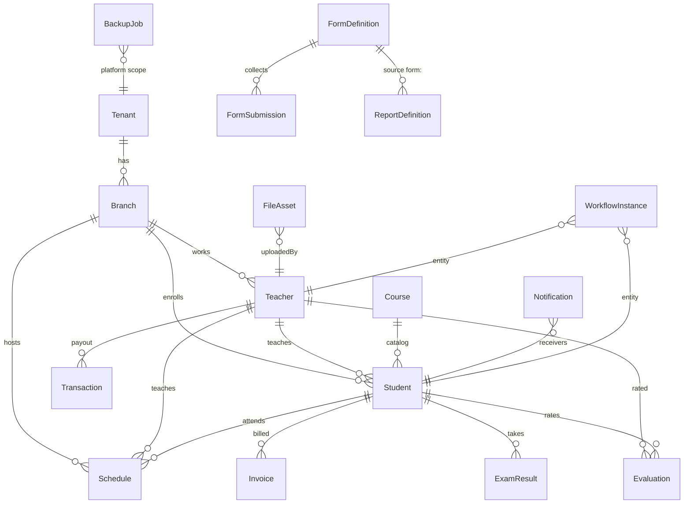
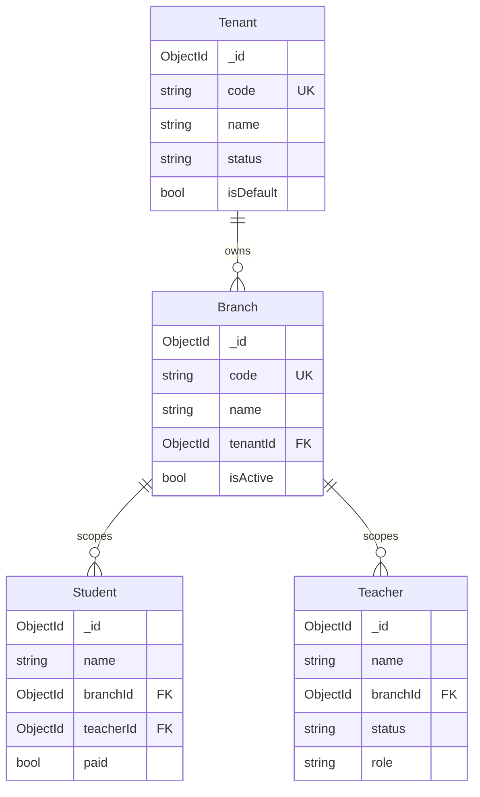
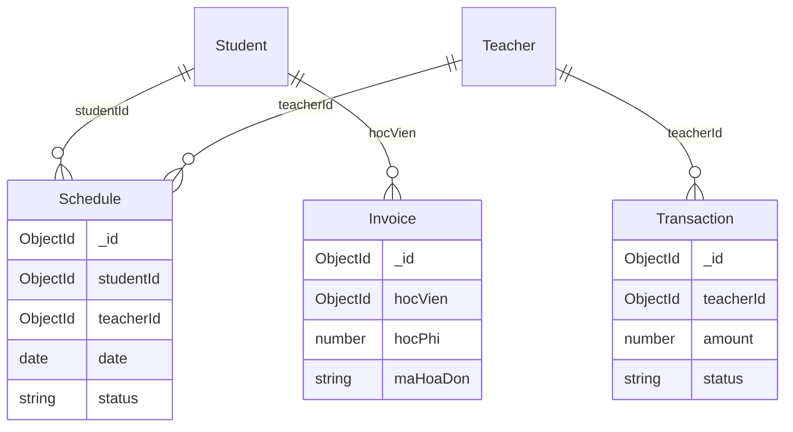

# QUANLYCMS — ERD (Entity Relationship)

Sơ đồ quan hệ logic MongoDB (Mongoose). Không phải SQL FK cứng; quan hệ qua `ObjectId` / string id.

## Tổng quan

## Multi-tenant & chi nhánh

## Học vụ & tài chính

## Module nền tảng (Phase 7–14)

| Collection | Quan hệ chính |
|------------|----------------|
| `notifications` | `receivers[]`, `read_by[]`, `dismissed_by[]` |
| `fileassets` | `category`, `uploadedBy`, `diskPath` |
| `backupjobs` | file `.json.gz` trên disk `backups/` |
| `workflowinstances` | `definitionKey` + `entityType`/`entityId` |
| `formdefinitions` / `formsubmissions` | form → answers |
| `reportdefinitions` | `source` + `columns[]` |

## Ghi chú

- Super Admin (`id=admin`) không nằm trong collection `teachers`.
- Staff là `Teacher` với `role=staff` / `adminRole=STAFF`.
- SystemSettings: singleton `_key=main` (cấu hình web, MFA, training data).