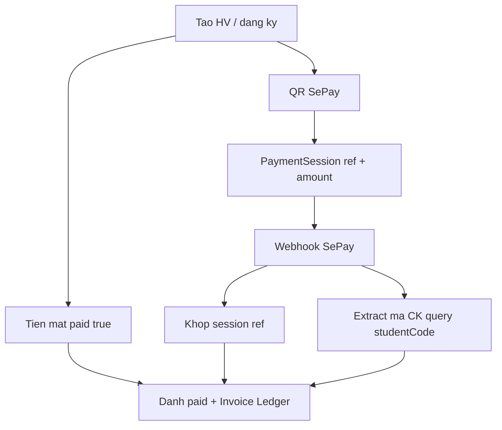

# Báo cáo: Mã học viên / học phí vs mã nhân viên

**Status:** REPORT ONLY (không đổi runtime)  
**Date:** 2026-08-11  
**Authority:** Live paths — `models/Student.js`, `AddStudentModal.jsx`, `routes/studentRoutes.js`, `routes/webhookRoutes.js`, `TuitionPaymentModal.jsx`, `models/Employee.js`, `routes/employeeRoutes.js`

---

## Kết luận

**Không khớp.** Mã học viên phục vụ **nhận học phí (SePay / QR)**. Nhân viên **không có** `employeeCode` — chỉ `_id` Mongo + chi trả lương thủ công (VietQR outbound). Hai luồng không dùng chung prefix, uniqueness hay logic khớp CK.

Ngoài ra, **trong nội bộ học viên** mã cũng **lệch** (`TTH…` phía QR vs `HV…` phía server).

---

## So sánh nhanh

| Khía cạnh | Học viên + học phí | Nhân viên + lương |
|-----------|--------------------|-------------------|
| Trường mã | `Student.studentCode` | **Không có** |
| Format | `TTH#####` (client) hoặc `HV########` (server) | N/A |
| Unique | Index sparse, **không unique** | N/A |
| Chiều tiền | **Inbound** về STK trung tâm | **Outbound** về STK NV |
| Khớp CK | Session `ref` hoặc extract mã → `studentCode` + số tiền | Không webhook; `POST .../pay` + PayrollLog |
| Nội dung QR | `… {mã} Nop hoc phi` | `Luong {tên}` / ghi chú tự do |

---

## 1. Mã học viên

- Lưu: `models/Student.js` — `studentCode` (“Mã HV dùng trong nội dung QR”).
- Sinh mã:
  - `client/src/components/admin/shared/AddStudentModal.jsx`: `TTH` + 5 số cuối `Date.now()` — gắn vào nội dung CK / payload khi QR thành công.
  - `routes/studentRoutes.js` create: nếu trống → `HV` + 8 số từ `Date.now()`.
  - Lưu chưa thanh toán / cash thường **không** gửi `TTH` từ modal → server gán **`HV…`**.
- `client/src/components/TuitionPaymentModal.jsx`: dùng `studentCode` đã lưu, không có thì lấy đuôi `_id`.

---

## 2. Luồng thanh toán học phí

| Cách | Cơ chế |
|------|--------|
| Tiền mặt | Create `paid: true` → invoice/ledger |
| QR | Tạo session + VietQR; webhook ưu tiên khớp **session ref**; không có session thì extract mã từ nội dung CK → tìm HV `studentCode` + amount ≈ học phí |

**Biến thể nội dung CK (rủi ro khớp):**

| Nơi | Pattern |
|-----|---------|
| AddStudent / AddEnrollment | `{Tên8} TTH##### Nop hoc phi` |
| RegistrationForm | `{branch?} {TÊN8} Nop hoc phi` — **không có** TTH/HV |
| TuitionPaymentModal | `{studentCode} Nop hoc phi {khóa}` |
| Hint chi nhánh (docs UI) | `CS1 TTH### Nop hoc phi` |

`Invoice.maHoaDon` (`HD…`) **không** dùng để khớp CK.

---

## 3. Mã / thanh toán nhân viên

- `models/Employee.js`: name, phone, salary, bank… — **không** `employeeCode`.
- Trả lương: `routes/employeeRoutes.js` `POST /:id/pay` → `PayrollLog`; QR VietQR tới tài khoản NV với ghi chú tự do.
- **Không** dùng SePay inbound / `studentCode`.

---

## 4. Có “khớp” với mã nhân viên không?

| Câu hỏi | Trả lời |
|---------|---------|
| Cùng prefix TTH/HV? | **Không** — NV không có mã |
| Cùng rule unique? | **Không** |
| Cùng logic khớp thanh toán? | **Không** |
| Mã HV có ổn định nội bộ? | **Một phần** — TTH (QR) vs HV (server) dễ lệch |

---

## Rủi ro đáng chú ý (chỉ HV)

1. QR hiện `TTH…` nhưng bản ghi lưu `HV…` (cash / quên gửi code) → rematch webhook theo mã khó.
2. `studentCode` không unique → trùng timestamp hiếm nhưng có thể.
3. Form đăng ký công khai CK theo tên, không theo mã lưu DB.
4. Nhân viên không có hệ mã song song — không thể “đối soát mã NV ↔ mã HV”.

---

## Verdict

- **HV ↔ NV:** không cùng hệ mã / không cùng luồng thanh toán → **không khớp**.
- **HV mã ↔ thanh toán học phí:** có thiết kế khớp qua `studentCode` + session, nhưng **triển khai không thống nhất** (TTH vs HV, nhiều format CK).

Báo cáo only — chưa sửa code. Chuẩn hóa (một prefix `studentCode`, gửi mã khi create, optional `employeeCode`) chỉ khi được yêu cầu riêng.
